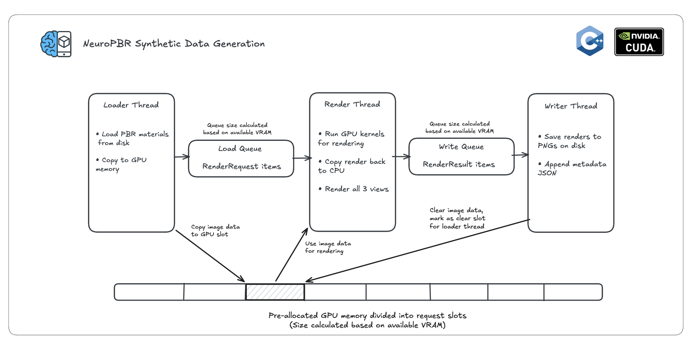

# Renderer

C++/CUDA renderer for generating synthetic training data using image-based lighting (IBL).

- Loads materials from the `dataset/` folder.
- Renders 3 randomized HDRI-lit views per material.
- Outputs paired (input renders + ground-truth PBR maps) for model training.

## Implementation Details

The renderer is built using **C++17** and **CUDA**, implementing a standard PBR pipeline optimized for high-throughput data generation.



### Multithreaded Pipeline & GPU Batching
To maximize GPU utilization and minimize I/O bottlenecks, the renderer uses a 3-stage multithreaded pipeline connected by thread-safe queues. The depth of this pipeline (the "batch size") is dynamically calculated at runtime based on available resources.

1.  **Loader Thread:** Reads material textures (Albedo, Normal, Roughness, Metallic) from disk, caches them in RAM, and uploads them into pre-allocated GPU memory slots.
2.  **Render Thread:** Consumes requests, executes the CUDA rendering kernels on the pre-loaded data, and downloads the results.
3.  **Writer Thread:** Saves the rendered images to disk as RGB PNGs using [fpng](https://github.com/richgel999/fpng) and recycles the GPU memory slots for new requests.

### Dynamic Resource Management
The renderer automatically detects available **System RAM** and **GPU VRAM** to determine the optimal batch size:
-   **Slot Size:** Each slot is sized for the largest material in the dataset, up to 2048×2048 unless `--max-res` is set: about 13 MB at 512×512 and 212 MB at 2048×2048.
-   **CPU Batch Limit:** Calculated to ensure enough RAM for each slot's pinned upload and output buffers, after reserving the material cache.
-   **GPU Batch Limit:** Calculated to ensure all in-flight materials fit within VRAM.
-   **Depth Cap:** At most `--pipeline-depth` slots (default 8), since more doesn't help once all three threads are busy.
-   **Pre-allocation:** The renderer pre-allocates all necessary GPU buffers at startup based on the determined batch size, eliminating runtime allocation overhead and fragmentation.

This ensures the renderer runs at maximum throughput on high-end systems while remaining stable on hardware with limited memory.

### Shading Model
It uses the **Cook-Torrance** microfacet specular shading model, which is the industry standard for PBR:
- **Distribution (D):** Trowbridge-Reitz (GGX)
- **Geometry (G):** Smith (Schlick-GGX)
- **Fresnel (F):** Schlick approximation

### Image-Based Lighting (IBL)
Lighting is purely image-based, using the **Split-Sum Approximation** to efficiently evaluate the lighting integral:
1.  **Irradiance Map:** A diffuse convolution of the environment map.
2.  **Prefiltered Environment Map:** Specular reflection pre-calculated at different roughness levels (stored in mipmaps).
3.  **BRDF Integration LUT:** A precomputed 2D texture storing the scale and bias for the Fresnel term.

### Output Color
Renders are 8-bit sRGB, like a camera photo:
1.  **Exposure:** Normalized per HDRI so an 18% grey surface renders at 0.18, with a random ±1 EV offset per view.
2.  **Tonemapping:** [Khronos PBR Neutral](https://github.com/KhronosGroup/ToneMapping/tree/main/PBR_Neutral).
3.  **Encoding:** sRGB, 8 bits per channel.

`albedo.png` is read as sRGB; the other maps are linear.

### Data Augmentation
To make the neural network robust to real-world imperfections, the renderer generates two types of data:
- **Clean:** Perfect PBR rendering.
- **Dirty:** Adds randomized synthetic degradations:
    -   **Shadows:** Procedurally simulated occlusion to mimic uneven lighting.
    -   **Camera Artifacts:** Procedurally simulated lens smudges and scratches.

### CUDA Kernels

The rendering logic is distributed across several optimized CUDA kernels:

-   `shadeKernel`: The primary ray-casting kernel. It computes the camera ray for each pixel, intersects it with the material plane, and evaluates the PBR shading model. It also handles the procedural generation of shadows and camera artifacts on the fly.
-   `unpackMaterialKernel`: Expands the 8-bit material maps to float.
-   `equirectangularToCubemap`: Converts input HDRI images (equirectangular projection) into cubemaps for efficient sampling. HDRIs are downscaled to 4× the cube face size while loading.
-   `convolveDiffuseIrradiance`: Computes the diffuse irradiance map by convolving the environment map with a cosine-weighted hemisphere.
-   `prefilterSpecularCubemap`: Generates the pre-filtered environment map for specular reflections, using importance sampling (GGX) at varying roughness levels.
-   `computeEnvironmentBrightness`: Analyzes the HDRI to determine horizon and zenith brightness, which drives the procedural shadow intensity.
-   `precomputeBRDF`: Generates the 2D LUT for the Split-Sum approximation.

## Prerequisites

- CMake 3.18 or newer
- NVIDIA CUDA Toolkit (matching the GPU in your system)
- A C++17 compiler with CUDA support (MSVC, Clang, or GCC + NVCC)

If you cloned without submodules, run:

```bash
git submodule update --init --recursive
```

## Build & Run

### Linux / WSL2 (Recommended)

Ensure you have `cmake`, `build-essential` (GCC), and the NVIDIA CUDA Toolkit installed.

```bash
cd renderer
cmake -S . -B build -DCMAKE_BUILD_TYPE=Release
cmake --build build --parallel
```

The binary will be written to `bin/neuropbr_renderer`.

### Command-line usage

```bash
./bin/neuropbr_renderer <materials_dir> <output_dir> <num_samples> [--continuing] [--material-cache-mb N] [--env-cache-dir DIR] [--no-env-cache] [--max-res N] [--pipeline-depth N]
```

- `<materials_dir>` – Path to the cleaned material dataset (each material folder must contain `albedo.png`, `normal.png`, `roughness.png`, `metallic.png` and be uniquely named).
- `<output_dir>` - Path to output the renders.
- `<num_samples>` – Number of samples to render; each sample produces three views and writes to `output/clean` or `output/dirty` plus `output/render_metadata.json`.
- `--continuing` / `-c` – Optional flag. If set, the renderer scans the output directory for the highest existing sample index and starts numbering new samples from there. It also detects any incomplete samples (missing views) and retries them before starting new renders.
- `--material-cache-mb N` – RAM budget for decoded materials. Defaults to min(2048, 25% of RAM); `0` disables it.
- `--env-cache-dir DIR` – Where precomputed HDRI cubemaps are cached (~32 MB each). Defaults to `cache/envmaps`; safe to delete.
- `--no-env-cache` – Precompute every HDRI at startup instead of using the cache.
- `--max-res N` – Render materials up to N×N pixels (compared by pixel count). Defaults to the largest material, capped at 2048×2048; larger ones are skipped.
- `--pipeline-depth N` – Maximum requests in flight (default 8).

Example (from `renderer/`):

```bash
./bin/neuropbr_renderer ../dataset/matsynth_clean 2000 --continuing
```

Ensure `assets/hdris` contain the required textures before rendering.

### Visual Studio (Windows Alternative)

If you must build on Windows, use the Visual Studio generator:

```bat
cmake -G "Visual Studio 17 2022" -A x64 -T host=x64 -S . -B build
cmake --build build --config Release --parallel
```
The binary will be at `bin/Release/neuropbr_renderer.exe`.
